# ToDo Приложение

Простое ToDo приложение, созданное с использованием Wails, React и PostgreSQL. Это приложение позволяет управлять задачами: создавать их, указывать приоритет и срок выполнения задачи, ставить отметку(Todo/Done), менять и удалять.
Все данные хранятся в локальном базе данных и не теряются при повторном запуске приложения.

## Функции

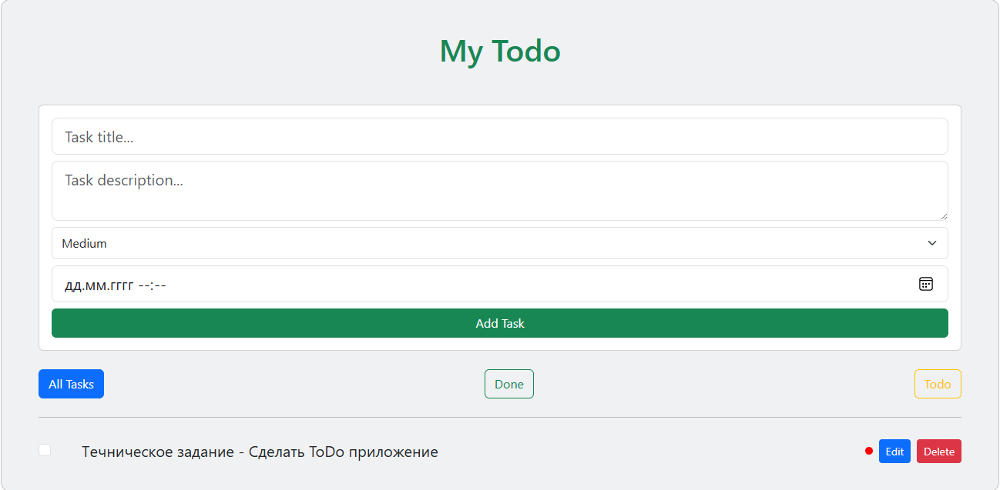
- Интерфейс с текстовым полем для ввода новой задачи
- Кнопка для добавления задачи в список
- Отображение всех задач на экране
- Использование CSS для стилизации интерфейса
- Использование значков для обозначения выполненных и невыполненных задач

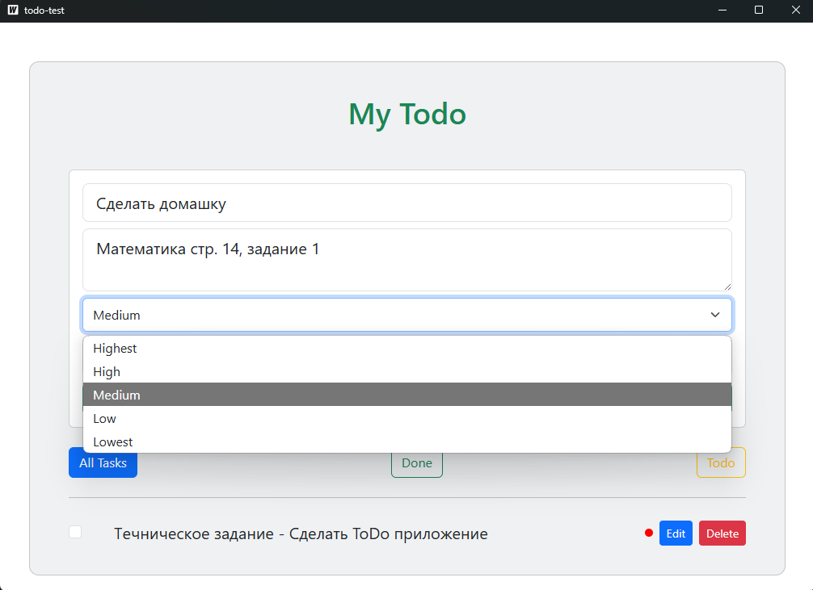
- Возможность добавления приоритета задачи
- Приоритеты обозначены цветами:
    - **highest** (Наивысший) - Красный
    - **high** (Высокий) - Оранжевый
    - **medium** (Средний) - Синий
    - **low** (Низкий) - Бирюзовый
    - **lowest** (Самый низкий) - Зеленый

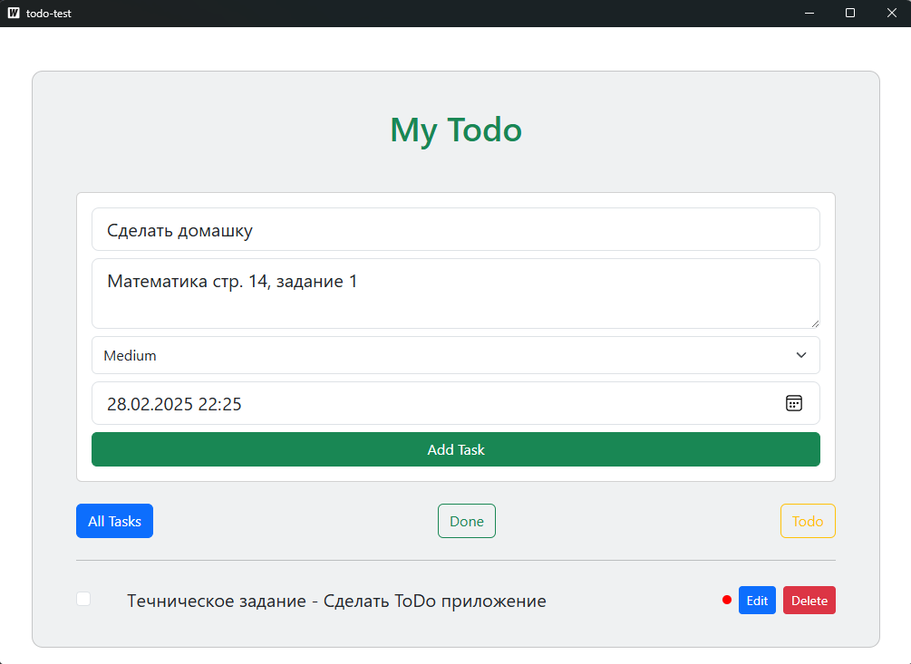
- Возможность добавлять задачи с указанием даты и времени выполнения.

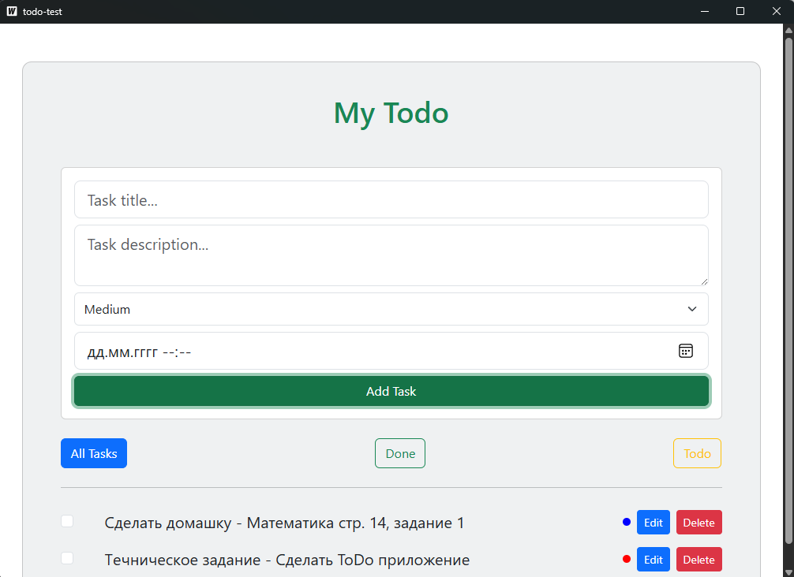
- Рабочий функционал добавления задачи

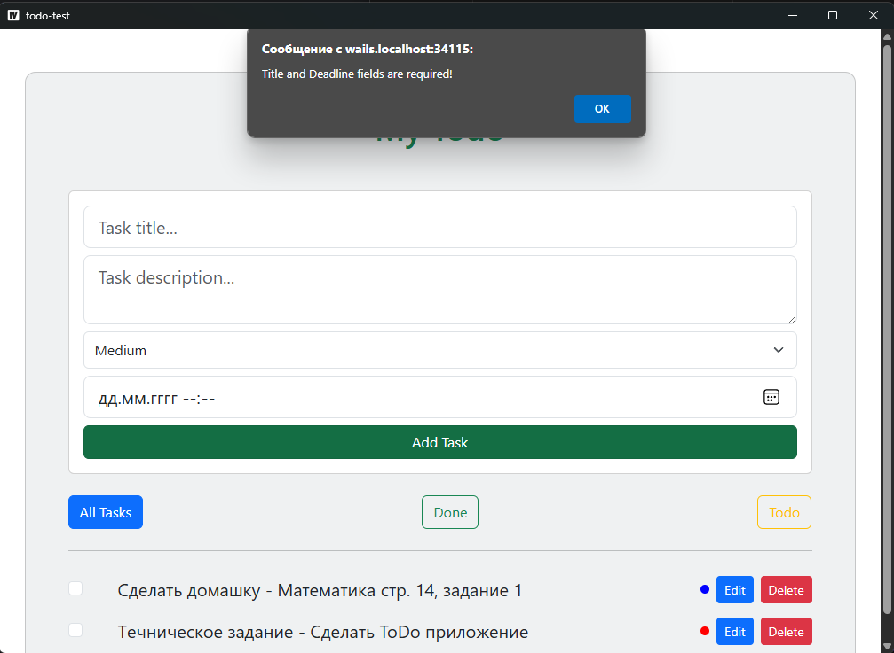
- Валидация ввода

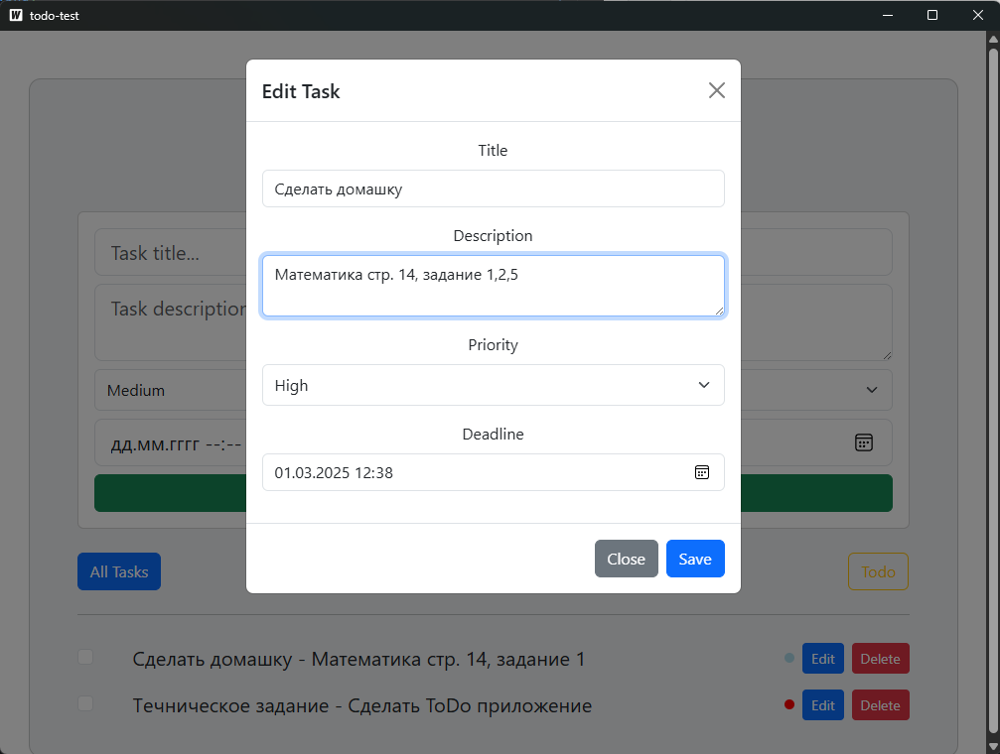
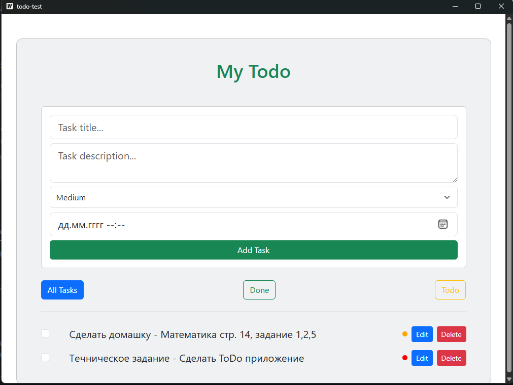
- Кнопка для изменения задачи.
- Функционал для изменения названия, описания, приоритета и срока выполения задачи.


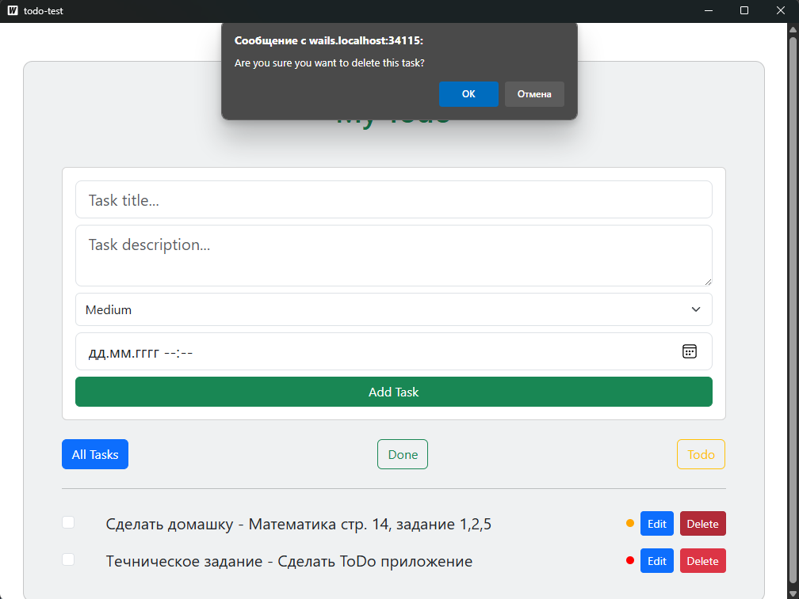
- Рабочий функционал удаления задачи
- Подтверждение удаления задачи (модальное окно)

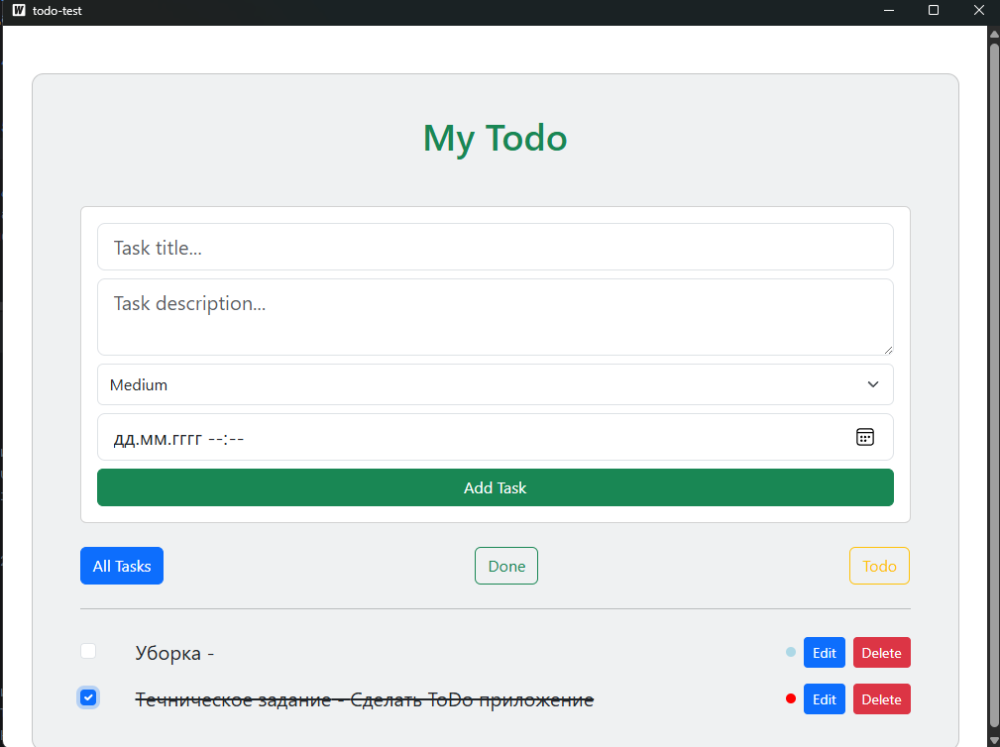
- Возможность отмечать задачу как выполненную.
- Зачеркивание текста выполненных задач.
- Возможность отмены отметки выполнения задачи.

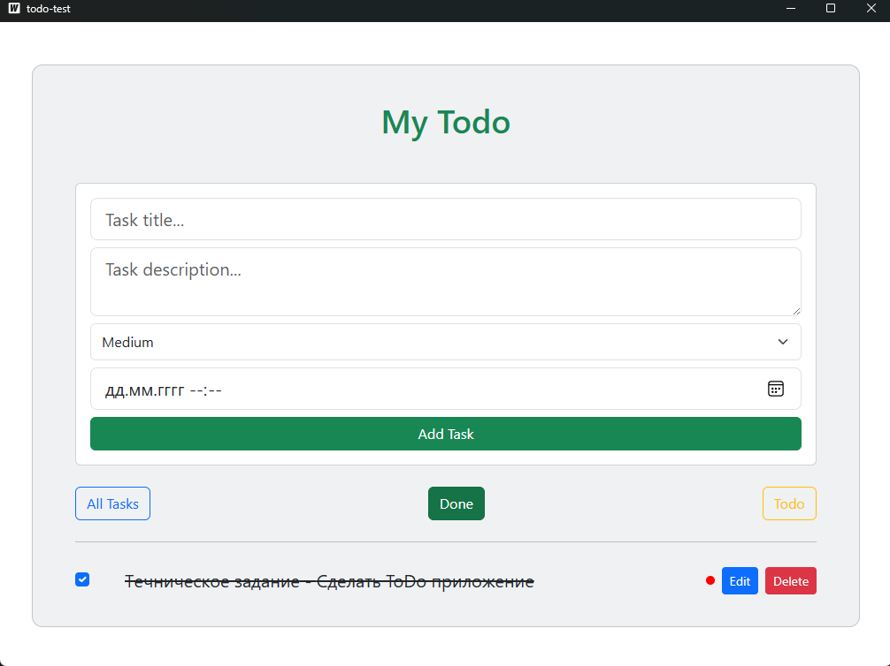
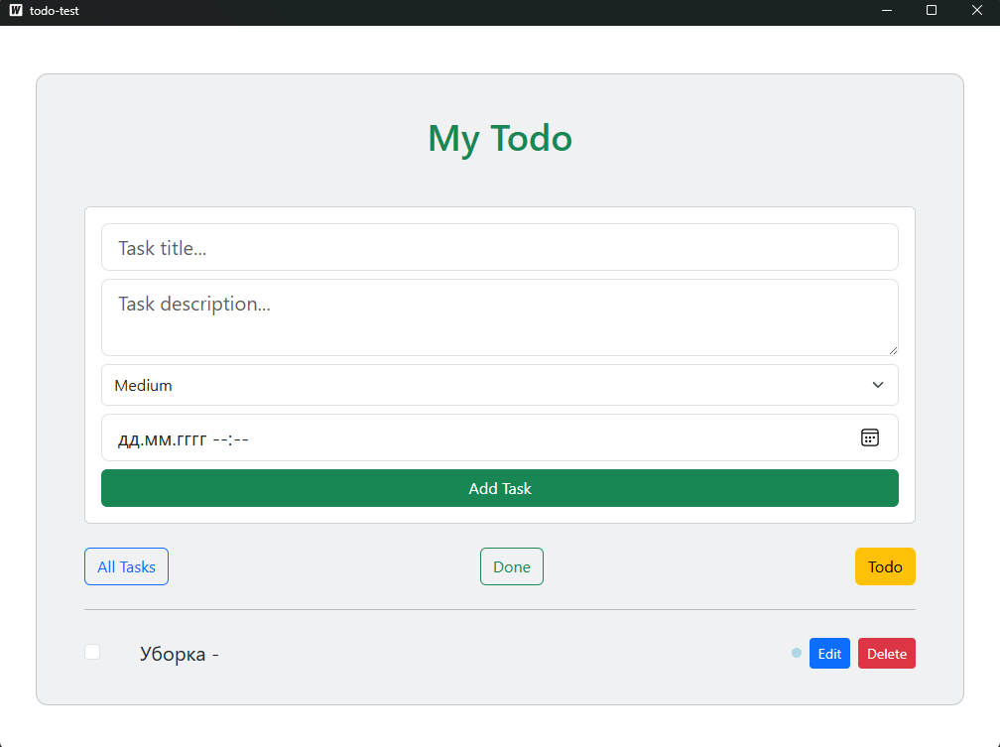
- Перемещение выполненных задач в отдельный раздел "Done".
- Все невыполненные задачи находятся в разделе "Todo".

## Требования

Перед запуском приложения убедитесь, что у вас установлены следующие зависимости:

- [Docker](https://www.docker.com/get-started)
- [Go](https://golang.org/dl/)
- [Node.js](https://nodejs.org/)
- [Wails](https://wails.io/)

## Инструкции по установке

Следуйте приведенным ниже шагам для локального запуска приложения.

### 1. Клонируйте репозиторий

Клонируйте репозиторий на ваш локальный компьютер:

```bash
git clone https://github.com/spargapees/todo-wails.git
cd todo-wails
```

### 2. Создайте файл .env
Создайте файл .env в корневом каталоге проекта и добавьте следующие переменные окружения:

```bash
DB_HOST=localhost
DB_PORT=5432
DB_USER=postgres
DB_PASSWORD=secret
DB_NAME=todo-test
```
Этот файл содержит настройки подключения к базе данных.
### Настройте контейнер PostgreSQL
Выполните следующую команду для запуска контейнера PostgreSQL:
```bash
make postgres
```
Эта команда запустит Docker-контейнер с базой данных PostgreSQL.

### 4. Примените миграции базы данных
Выполните следующую команду для применения миграций и настройки схемы базы данных:
```bash
make migrationup
```
### 5. Запустите приложение
После настройки базы данных запустите приложение Wails с помощью следующей команды:
```bash
make wails
```
Эта команда скомпилирует приложение и откроет интерфейс в вашем браузере по умолчанию.
## Обзор команд

```bash 
make postgres
```
Запускает контейнер PostgreSQL.
```bash 
make migrationup
```
Применяет миграции "up".
```bash 
make migrationdown
```
Применяет миграции "down".
```bash 
make wails
```
Запускает приложение Wails.
```bash
make dropdb
```
Удаляет базу данных PostgreSQL.
```bash
make createdb
```
Создает базу данных PostgreSQL.
## Устранение неполадок
Если контейнер базы данных не запущен: Вы можете запустить его вручную с помощью команды: 
```bash
docker start todo-test-db
```
Если приложение не запускается: Убедитесь, что все зависимости (Go, Wails, Node.js, Docker) установлены правильно.